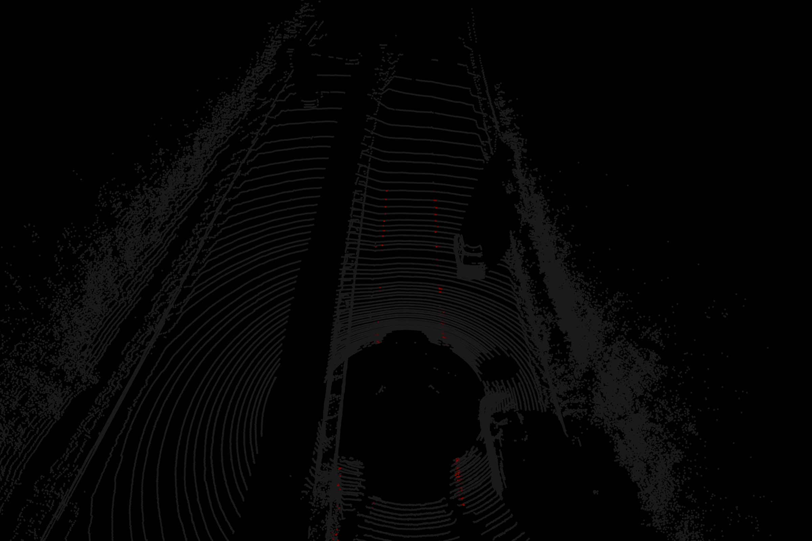
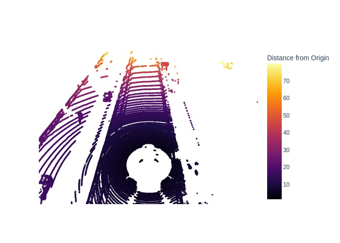
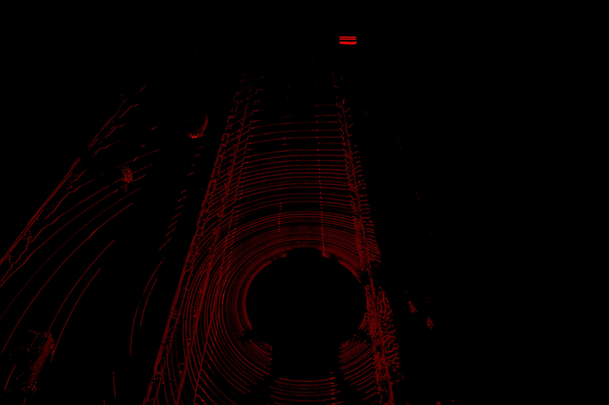
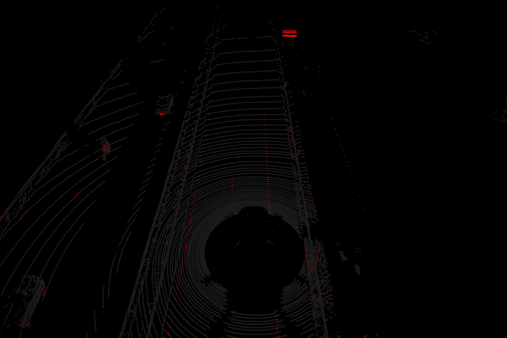

# LiDAR-Based Lane Line Detection

This project focuses on the detection of lane lines using data from the KITTI dataset, harnessing the reflective properties of LiDAR data. The final output is showcased in the following video:

[](https://youtu.be/sRLQclswgug)

## About the Dataset

In this project, we make use of the KITTI dataset. To obtain this dataset, simply execute the following commands from your project folder:

```shell
cd data/
wget https://point-clouds-data.s3.us-west-2.amazonaws.com/KITTI_PCD.zip && unzip KITTI_PCD.zip
rm KITTI_PCD.zip
```

You can preview the point cloud data below:



## Lane Line Extraction - The Concept

Our methodology relies on the reflectivity values encoded within the colors column of the dataset. Lane lines are identified based on their higher reflectance, making them visible even in low-light conditions. This reflective property is pivotal for distinguishing lane lines from other points. However, there are also other objects with high reflectivity. In this project, we employ the following techniques to isolate the lane lines amidst other data points:

1. **Thresholding**
2. **Region of Interest (ROI)**

The reflectance pattern is visually represented below:



## Thresholding

After conducting manual experimentation, a threshold value of 0.45 is determined as the optimal choice for lane line filtering. The resulting image is depicted below. It's important to note that this thresholding filter also captures other objects like traffic signs and license plates.



## Region of Interest (ROI)

To account for the presence of other highly reflective objects, such as traffic signs and license plates, the region-of-interest segmentation is employed. The vehicle's coordinate system adheres to the right-hand rule, with x facing forward, y facing left, and z facing up. The ROI is defined as (x1=-20, y1=-3, z1=-2) to (x2=20, y2=3, z2=0), effectively segmenting the road lane lines from the surrounding environment. The resulting output is displayed below:


Please be aware that these settings are manually configured and may require fine-tuning. By applying the above techniques to multiple point cloud files, the final output demonstrated in the initial video can be achieved.

## Future Plans

Although the current approach involves some manual intervention, the process can be enhanced through the following strategies:

- Utilizing normal estimation techniques
- Refining the definition of the ROI
- Implementing clustering methods
- Exploring deep learning approaches

### Credits

This project was inspired and guided by Jeremy Cohen's course at Think Autonomous.
